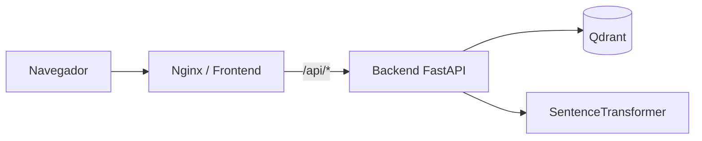

# Proyecto Hobbys

Buscador de talleres y cursos de hobbies en CABA. El usuario describe en lenguaje natural qué quiere aprender; el sistema devuelve resultados relevantes en una lista y en un mapa interactivo.

## Arquitectura



| Servicio   | Rol |
|------------|-----|
| **Frontend** | SPA React + Vite servida por Nginx. Proxy de `/api` al backend. |
| **Backend**  | API FastAPI con búsqueda híbrida (filtros + similitud semántica). |
| **Qdrant**   | Base vectorial con embeddings de título y descripción de cada curso. |

## Stack

- **Frontend:** React 19, TypeScript, Vite, Leaflet / react-leaflet
- **Backend:** Python 3.12, FastAPI, Sentence Transformers (`all-MiniLM-L6-v2`), Qdrant Client
- **Infra:** Docker Compose, Nginx, Qdrant v1.13

## Requisitos

- [Docker](https://docs.docker.com/get-docker/) y Docker Compose v2
- Para desarrollo local sin Docker: Node.js 20+, Python 3.12+, Qdrant accesible en `localhost:6333`

## Inicio rápido (Docker)

Desde la raíz del proyecto:

```bash
docker compose up --build
```

Servicios disponibles:

| URL | Descripción |
|-----|-------------|
| http://localhost | Frontend (interfaz de búsqueda) |
| http://localhost:8000/docs | Documentación interactiva de la API (Swagger) |
| http://localhost:6333 | Qdrant (solo si necesitás inspeccionar la base vectorial) |

El backend tarda un poco en arrancar la primera vez: descarga el modelo de embeddings e indexa los cursos de `backend/data.json` en Qdrant.

Para detener los contenedores:

```bash
docker compose down
```

Los datos de Qdrant persisten en el volumen `hobbys-qdrant-data`. Para borrarlos:

```bash
docker compose down -v
```

## Desarrollo local

### Backend

```bash
cd backend
python -m venv venv
source venv/bin/activate
pip install -r requirements.txt

# Qdrant debe estar corriendo (por ej. solo ese servicio con Docker)
docker compose up qdrant -d

export QDRANT_HOST=localhost
export QDRANT_PORT=6333
uvicorn main:app --reload --port 8000
```

### Frontend

```bash
cd frontend
cp .env.example .env   # opcional; el proxy de Vite ya apunta a /api
npm ci
npm run dev
```

La app queda en http://localhost:5173. Vite proxifica `/api` hacia `http://127.0.0.1:8000` (ver `frontend/vite.config.ts`).

## API

### `GET /health`

Estado del servidor, cantidad de cursos cargados y conexión a Qdrant.

### `POST /api/search`

Búsqueda híbrida de cursos.

**Body:**

```json
{ "query": "quiero aprender a cocinar" }
```

**Query params opcionales:**

- `sort=similitud` (default) — orden por relevancia semántica
- `sort=valoracion` — orden por valoración

**Pipeline interno:**

1. Detección de intención (categoría y público objetivo en la consulta)
2. Filtro duro por categoría en Qdrant, si aplica
3. Búsqueda vectorial asimétrica (70% título, 30% descripción)
4. Soft boosting por nivel y público
5. Ordenamiento final

## Estructura del proyecto

```
hobbys/
├── docker-compose.yml      # Orquestación de los tres servicios
├── backend/
│   ├── main.py             # API y motor de búsqueda
│   ├── data.json           # Catálogo de cursos (fuente de verdad)
│   ├── requirements.txt
│   └── Dockerfile
└── frontend/
    ├── src/
    │   ├── api/            # Cliente HTTP hacia /api/search
    │   ├── components/     # UI: búsqueda, tarjetas, mapa
    │   └── hooks/          # Estado de búsqueda y selección
    ├── nginx.conf          # SPA + proxy /api (producción)
    ├── Dockerfile
    └── .env.example
```

## Variables de entorno

### Backend

| Variable | Default | Descripción |
|----------|---------|-------------|
| `QDRANT_HOST` | `localhost` | Host de Qdrant |
| `QDRANT_PORT` | `6333` | Puerto de Qdrant |
| `CORS_ORIGINS` | — | Orígenes permitidos (usado en Compose) |

### Frontend (build time)

| Variable | Default | Descripción |
|----------|---------|-------------|
| `VITE_API_BASE_URL` | `/api` | Base URL del API. En Docker, Nginx proxifica al backend. |

## Datos de cursos

Los cursos viven en `backend/data.json`. Al iniciar el backend:

1. Carga el JSON
2. Crea o reutiliza la colección `cursos_hobby` en Qdrant
3. Genera embeddings y hace upsert de todos los registros

Para agregar o modificar cursos, editá `data.json` y reiniciá el backend (o el contenedor `backend`).

## Comandos útiles

```bash
# Reconstruir solo el frontend tras cambios en la UI
docker compose up --build frontend

# Ver logs de un servicio
docker compose logs -f backend

# Build de producción del frontend (sin Docker)
cd frontend && npm run build && npm run preview
```
